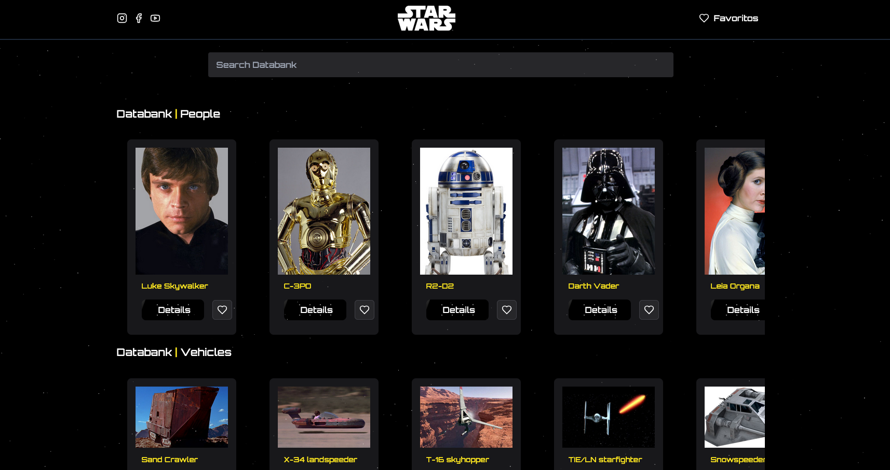

# Starwars Blog

<p align="center">
  
</p>

¡Bienvenido a Starwars Blog!  
Este proyecto es una SPA (Single Page Application) desarrollada en React que consume la API de Star Wars para mostrar información sobre personajes, vehículos y planetas del universo Star Wars. Incluye funcionalidades de favoritos, detalles, buscador y una experiencia visual inspirada en la saga.

## Características

- **Listado de personajes, vehículos y planetas** con imágenes.
- **Detalle de cada ítem** con información extendida.
- **Sistema de favoritos**: guarda tus personajes, vehículos y planetas favoritos (persistente en localStorage).
- **Buscador** para filtrar rápidamente.
- **Loader animado** (LaserLoader) mientras se cargan los datos.
- **Responsive** y con estilos personalizados inspirados en Star Wars.
- **Cursor personalizado** y favicons dinámicos para modo claro/oscuro.

## Tecnologías usadas

- React
- React Router
- Context API
- TailwindCSS (o CSS personalizado)
- Lucide React Icons

## Instalación

1. Clona el repositorio:
   ```bash
   git clone https://github.com/DevWilfredo/StarWars-Page.git
   cd StarWars-Page
   ```

2. Instala las dependencias:
   ```bash
   npm install
   ```

3. Crea un archivo `.env` en la raíz del proyecto con las siguientes variables:
   ```
   VITE_API_URL='https://www.swapi.tech/api'
   VITE_IMG_URL='https://raw.githubusercontent.com/breatheco-de/swapi-images/refs/heads/master/public/images'
   ```

4. Inicia la aplicación:
   ```bash
   npm run dev
   ```

## Scripts útiles

- `npm run dev` — Inicia el servidor de desarrollo.
- `npm run build` — Genera la versión de producción.
- `npm run preview` — Previsualiza la build de producción.

## Estructura del proyecto

```
src/
  components/    # Componentes reutilizables (Navbar, LaserLoader, Grid, etc.)
  context/       # Contexto global (AppContext)
  pages/         # Vistas principales (Home, Details, etc.)
  index.css      # Estilos globales
  main.jsx       # Entry point
```

## Imágenes

> **Nota:**  
> Las imágenes se obtienen dinámicamente desde  
> `https://raw.githubusercontent.com/breatheco-de/swapi-images/refs/heads/master/public/images/{type}/{id}.jpg`  
> Por ejemplo:  
> - Personaje: `/people/1.jpg`  
> - Planeta: `/planets/3.jpg`  
> - Vehículo: `/vehicles/4.jpg`

## Créditos

- [SWAPI](https://www.swapi.tech/) — API de Star Wars.
- [BreatheCode SWAPI Images](https://github.com/breatheco-de/swapi-images) — Banco de imágenes dinámico para Star Wars.
- [Icons8](https://icons8.com/) — Favicons y cursores.

---

## Autor

- **Wilfredo**
- Portfolio: [https://wilfredodev.com](https://wilfredodev.com)

---

¡Que la fuerza te acompañe!
